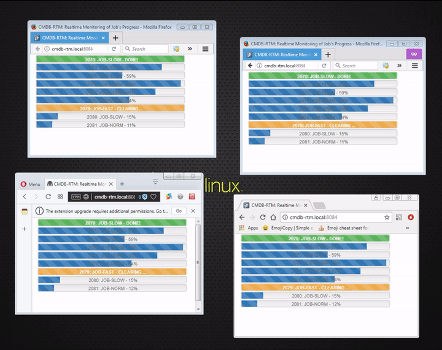
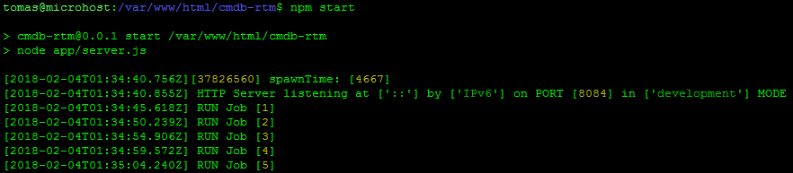
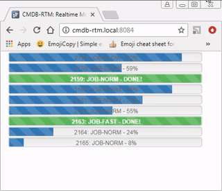
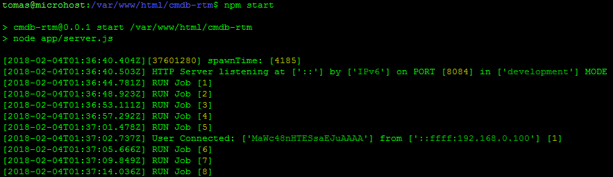

# CMDB-rtm #

Real-time Tasks Progress Visualization

[](https://github.com/conventional-changelog/standard-version)
<!--/ [](https://david-dm.org/tbaltrushaitis/cmdb-rtm) /-->
<!--/ [](https://github.com/tbaltrushaitis/cmdb-rtm/blob/master/LICENSE.md) /-->



`cmdb` `real-time` `monitoring` `data visualization`

---

## Live Demo ##
Try to open this [page](http://bit.ly/cmdb-rtm-live) :point_left: in:

- :zero::zero: - **several tabs** of your current browser
 or
- :zero::five: - do it in **several different browsers**
 or
- :five::zero: - use **several different devices** to try from

All data about tasks progress status will be shown as HTML elements with various
(if there are any) animations. Live page can be viewed `simultaneously` on any
device and all instances should look same.

---

## Getting started ##

Its simple. Get it done in the way like this piece of shi*, sorry, of course pieces of code below:

Simply clone the repository and then run `make` inside of a cloned directory:

```shell
$  REPO="cmdb-rtm" \
&& git clone "https://github.com/tbaltrushaitis/${REPO}" \
&& cd ${REPO} \
&& make ;
```

then `start` as a service:

```shell
$ npm start
```

- [x] It might looks like:



Then navigate your agent to :point_right: `http://localhost:8084/`

- [x] Tasks queue data should be **visible** and **animated**:



- [x] Check output of server console:



---

## Credits ##

 Scope | Role | Name | Version | Description
:-----:|:----:|:-----|:-------:|:------------
 Front | Library | [animate.css](http://daneden.github.io/animate.css/) | [3.7.2](https://github.com/daneden/animate.css/tree/3.7.2) | A cross-browser library of CSS animations
 Front | Framework | [Bootstrap](http://getbootstrap.com) | [3.4.1](https://getbootstrap.com/docs/3.4/) | HTML, CSS, and JS framework
 Front | Library | [jQuery](http://jquery.com/) | [3.4.1](https://github.com/jquery/jquery/tree/3.4.1) | JavaScript Library
 Front | Library | [Lodash](https://lodash.com/) | [4.17.21](https://lodash.com/docs/4.17.21) | A modern JavaScript utility library delivering modularity, performance & extras.

---

## TODO List ##

- [ ] Implement business logic within a real ES6 Class instances
- [x] ~~Create repository~~ (Done v0.0.0)

See the [Changelog][Changelog] for the history of project changes and improvements.

---

This product is [MIT Licensed][License]

---

### More Info ###

 - [GitHub / Basic writing and formatting syntax](https://help.github.com/articles/basic-writing-and-formatting-syntax/)
 - [BitBucket Markdown Howto](https://bitbucket.org/tutorials/markdowndemo)
 - [Creating an Automated Build](https://docs.docker.com/docker-hub/builds/)

---

> Developed in **November 2016**

:scorpion:

[Changelog]: CHANGELOG.md
[License]: LICENSE.md
