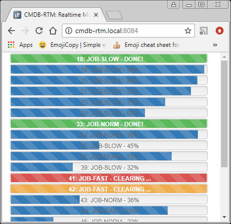

# cmdb-rtm #

Plugin for CMDB application that work with data in real time.

`cmdb` `real-time` `monitoring`

---

## Environment ##
:TODO

---

## Dependencies ##
- [requirejs](https://github.com/jrburke/requirejs) v2.3.5 - A file and module loader for JavaScript.
- [AdminLTE](https://almsaeedstudio.com/) v2.3.2 - Control Panel Template.
- [animate.css](http://daneden.github.io/animate.css/) v3.5.2 - A cross-browser library of CSS animations.
- [Bootstrap](http://getbootstrap.com) v3.3.7 - HTML, CSS, and JS framework
- [Font-Awesome](http://fontawesome.io/) v4.7.0 - The iconic font and CSS toolkit.
- [Ionicons](http://ionicons.com/) v4.0.0 - The premium icon font for Ionic.
- [jQuery](http://jquery.com/) v2.2.4 - JavaScript Library
- [jQuery-UI](http://jqueryui.com/) v1.12.1 - The official jQuery user interface library.
- [noty](http://ned.im/noty) v2.3.11 - jQuery plugin that makes it easy to create alert - success - error - warning - information - confirmation messages as an alternative the standard alert dialog.
- [Underscore.js](http://underscorejs.org) v1.8.3 - JavaScript library that provides a whole mess of useful functional programming helpers.

---

## Getting started ##

* git clone https://bitbucket.org/devopscrew/cmdb-rtm
* cd cmdb-rtm
* git checkout dev
* git pull
* npm i
* bower i
* gulp

---

## Required configuration ##
:TODO

---

## Todo List ##

 - ~~Create gulpfile.js scenario~~ (Done v0.0.1)
 - ~~Initial release~~ (Done v0.0.0)

---

## Change log ##

**v0.0.1:**
 - Added bower.json
 - Added package.json
 - Added gulpfile.js

**v0.0.0:**
 - Initial release

---
