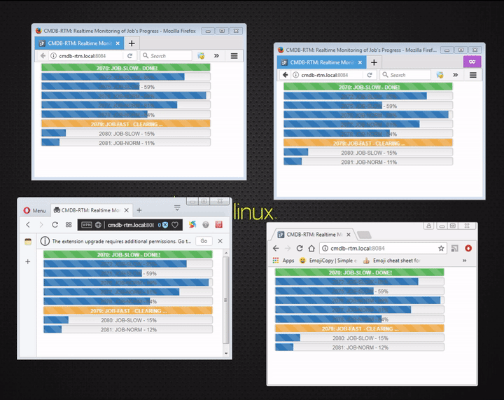
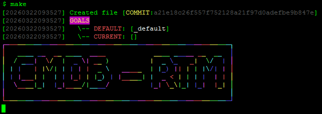
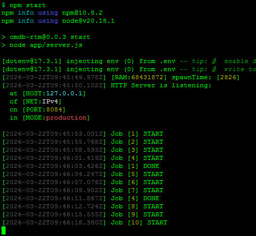
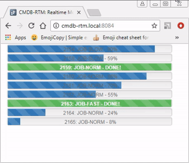
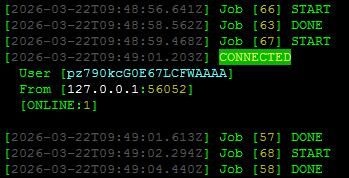

<p align="center">
  <a href="https://github.com/conventional-changelog/standard-version"></a>
  <a href="https://github.com/tbaltrushaitis/cmdb-rtm/blob/master/LICENSE"></a>
  <a href="https://github.com/tbaltrushaitis/cmdb-rtm/releases"></a>
</p>

<p align="center">
  <h2 align="center">Real-time Tasks Progress Visualization</h2>
</p>

<p align="center">
  <a href="http://bit.ly/cmdb-rtm-live?ref=readme">
    
  </a>
</p>

`cmdb` `real-time` `monitoring` `data visualization`

---

## Live Demo
Try to open this [page](http://bit.ly/cmdb-rtm-live) :point_left: in:

- :zero::zero: - **several tabs** of your current browser
 or
- :zero::five: - do it in **several different browsers**
 or
- :five::zero: - use **several different devices** to try from

All data about tasks progress status will be shown as HTML elements with various
(if there are any) animations. Live page can be viewed `simultaneously` on any
device and all instances should look same.

---

## Getting started

Its simple. Get it done in the way like this piece of shi*, sorry, of course pieces of code below:

Simply clone the repository:

```shell
$  REPO="cmdb-rtm" \
&& git clone "https://github.com/tbaltrushaitis/${REPO}" \
&& cd ${REPO} ;
```

Deploy with `make` command inside of a cloned directory:

```shell
$ make
```


Now it ready to run via `npm`:

```shell
$ npm start
```

- [x] Output like this should appear in the terminal:



Now, open any preferred web browser and visit :point_right: `http://localhost:8084/`

- [x] Tasks queue data should be **visible** and **animated**:



- [x] Output like this should appear in the terminal:



---

## Frontend built with

 Scope | Role | Name | Version | Description
:-----:|:----:|:-----|:-------:|:------------
 Front | Library | [animate.css](http://daneden.github.io/animate.css/) | [4.1.1](https://github.com/daneden/animate.css/tree/v4.1.1) | A cross-browser library of CSS animations
 Front | Framework | [Bootstrap](http://getbootstrap.com) | [3.4.1](https://getbootstrap.com/docs/3.4/) | HTML, CSS, and JS framework
 Front | Library | [jQuery](http://jquery.com/) | [3.7.1](https://github.com/jquery/jquery/tree/3.7.1) | JavaScript Library
 Front | Library | [Lodash](https://lodash.com/) | [4.17.23](https://lodash.com/docs/4.17.23) | A modern JavaScript utility library delivering modularity, performance & extras.
 Front | Library | [socket.io](https://github.com/socketio/socket.io/tree/main/packages/socket.io#readme) | [2.5.1](https://lodash.com/docs/4.17.23) | Bidirectional and low-latency communication for every platform.

```shell
$ bower list
cmdb-rtm
├── animate.css#4.1.1
├─┬ bootstrap#3.4.1 (latest is 5.3.8)
│ └── jquery#3.7.1 (latest is 4.0.0)
├── font-awesome#5.14.0 (latest is 7.2.0)
├── jquery#3.7.1 (latest is 4.0.0)
├── jquery-tmpl#ef4ae98374
├── lodash#4.17.23
├── noty#2.4.1 (latest is 3.2.0-beta)
├── requirejs#2.3.8
├── socket.io#2.5.1 (latest is 4.7.5)
└── text#2.0.16
```

---

## TODO List

- [ ] Implement logic within a real ES6 Class instances
- [x] ~~Create repository~~ (Done in **v0.0.0**)

See the [Changelog][Changelog] for the history of the project changes and improvements.

---

This product is [MIT Licensed][License]

---

### More Info

 - [GitHub / Basic writing and formatting syntax](https://help.github.com/articles/basic-writing-and-formatting-syntax/)
 - [BitBucket Markdown Howto](https://bitbucket.org/tutorials/markdowndemo)
 - [Creating an Automated Build](https://docs.docker.com/docker-hub/builds/)

---

> Developed in **November 2016**

:scorpion:

[Changelog]: CHANGELOG.md
[License]: LICENSE.md
